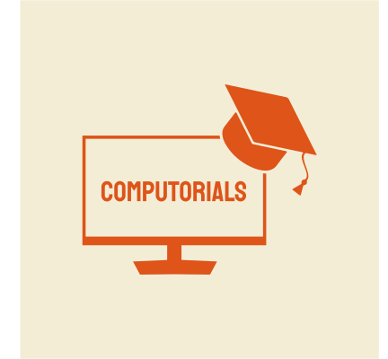

# Computorials

## Overview
Computorials is a new interactive way of learning about computers and their components. Whether you're a beginner looking to understand the basics or an advanced user wanting a deeper dive into hardware and software, Computorials offers engaging, hands-on learning experiences.

## Features
- **Interactive Modules** – Learn through engaging simulations and guided tutorials.
- **Visualized Components** – Explore detailed 3D models of computer parts.
- **Hands-on Experiments** – Experiment with virtual builds and configurations.
- **Quizzes & Challenges** – Test your knowledge and track progress.
- **Beginner-Friendly** – No prior experience needed!

## Getting Started
1. **Install Computorials** – Download and install the application.
2. **Choose a Module** – Select a topic that interests you.
3. **Start Exploring** – Follow guided instructions, interact with components, and take quizzes to reinforce learning.

## Target Audience
Computorials is perfect for:
- Students learning about computers for the first time.
- Enthusiasts wanting a deeper understanding of hardware and software.
- Educators looking for interactive teaching tools.
- Anyone curious about how computers work!

